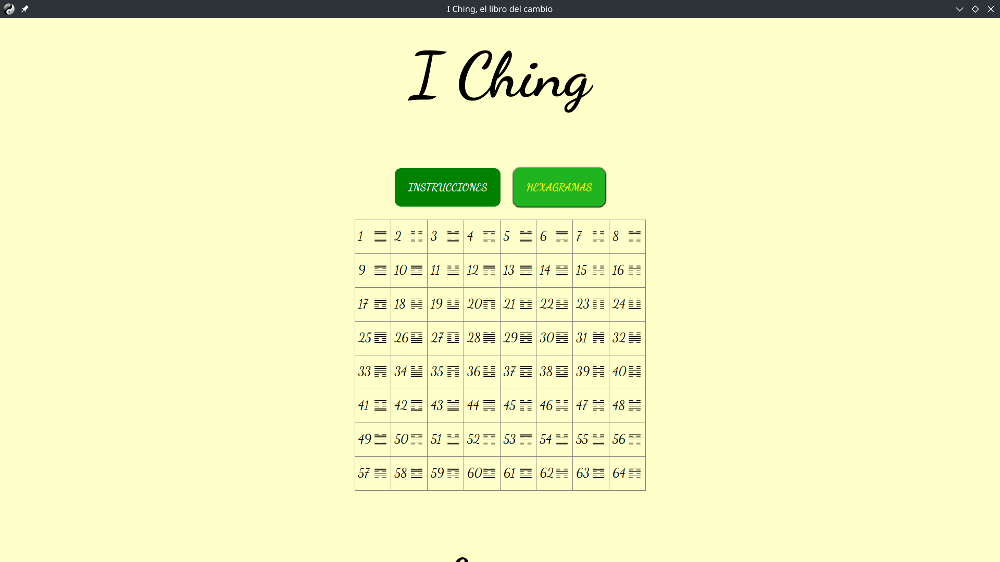
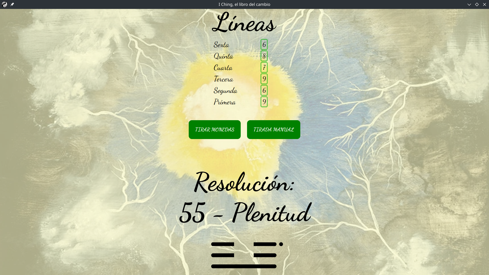

# I Ching, el libro del cambio en Electron

Esto es el I Ching, el libro del cambio. Para el que no lo conozca, es como una especie de tarot chino, y puede servir para ayudar a tomar decisiones e incluso "adivinar el futuro".

Usa Electron para funcionar (requiere la carpeta node_modules). Se puede ejecutar directamente con <i>node run start</i> o <i>npm start</i>.

<h2>Capturas</h2>

<h2>Por hacer</h2>
<ul>
  <li>Sustituir imágenes por unas generadas por IA. El generador de imágenes de Bing es el que mejor resultados da, así que será la IA elegida.</li>
</ul>

Textos: Universidad de Princeton, traducidos por Brian Arnold.

