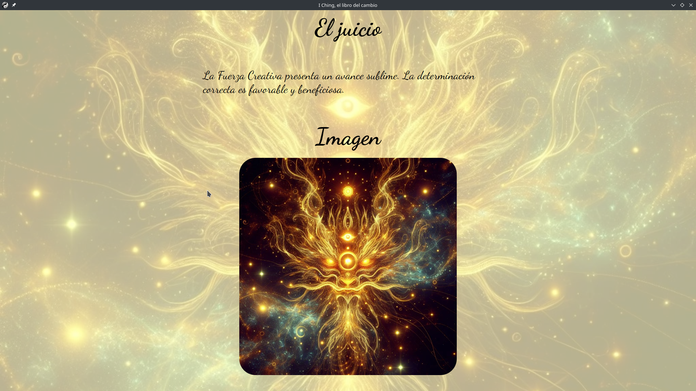

# I Ching, el libro del cambio en Electron
Esto es el I Ching, el libro del cambio. Para el que no lo conozca, es como una especie de tarot chino, y puede servir para ayudar a tomar decisiones e incluso "adivinar el futuro".

## Características
* Posibilidad de tirar las monedas automáticamente o manual.
* Sección con hexagramas.
* Hexagrama complementario y textos más explicativos si hay líneas móviles.
* Imágenes generadas por IA (DALL-E -lo que mejores resultados ofreció-).
* Texto © 1950, 1967, renovado en 1977 por la Princeton University Press.
* Disponible para Linux (tar.gz, AppImage y .deb) y Windows (portable). Para otros sistemas es necesario Electron para que funcione (requiere la carpeta node_modules). Se puede ejecutar directamente con `node run start` o `npm start`, o compilarlo con `node run dist` si se modifica el archivo package.json para la plataforma de destino.

## Capturas

