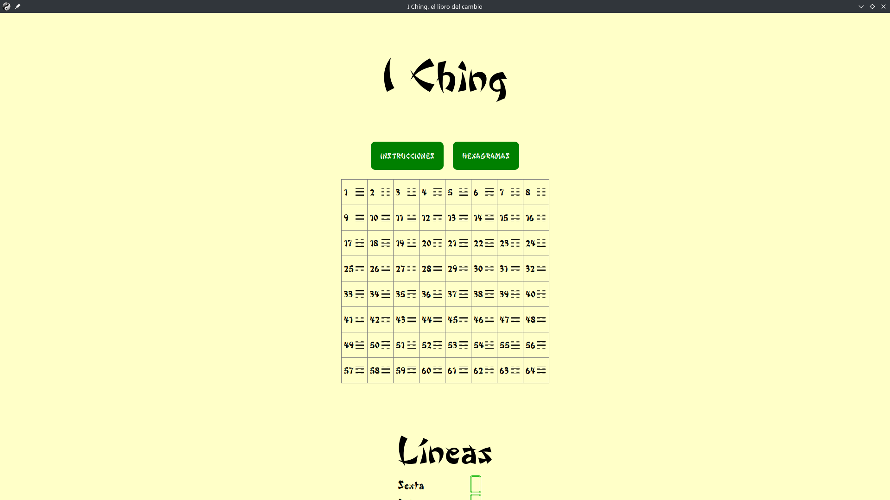

# I Ching, el libro del cambio en Electron

Esto es el I Ching, el libro del cambio. Para el que no lo conozca, es como una especie de tarot chino, y puede servir para ayudar a tomar decisiones e incluso "adivinar el futuro".

Usa Electron para funcionar. Se puede ejecutar directamente con <i>node run start</i> o <i>npm start</i>.

<h2>Capturas</h2>

